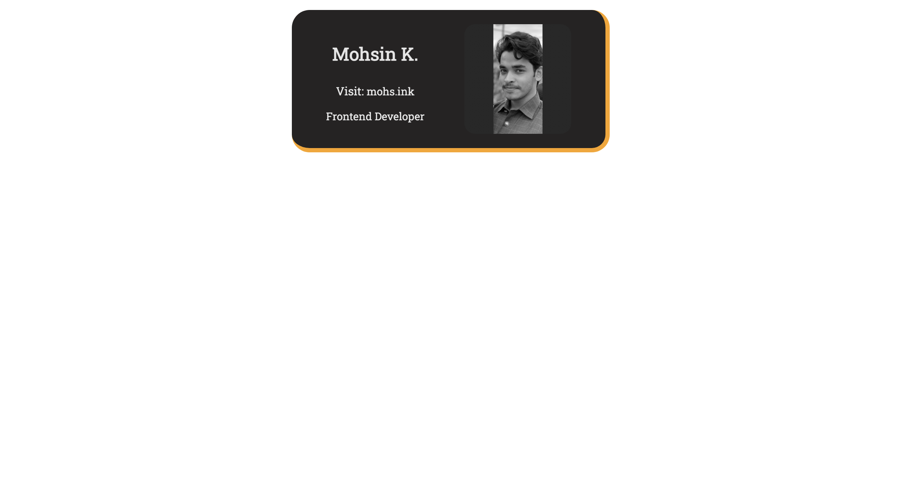

# Scrimba - Digital Card

## Table of contents

- [Overview](#overview)
  - [Screenshot](#screenshot)
  - [Links](#links)
- [Useful resources](#useful-resources)
- [Author](#author)

## Overview

### Screenshot

### Links

- Code URL: [Solution](https://github.com/mohs-in/frontend-projects/tree/main/card-overview)
- Live Site URL: [Live Site](https://cardOverview.mohs.ink)

## Useful resources

- [Google Fonts](https://fonts.google.com/) 
- [Coolors](https://coolors.co/) 

## Author

- Website - [Mohsin](https://www.mohs.ink)
- Twitter - [@mohsin_khansab](https://www.twitter.com/mohsin_khansab)

